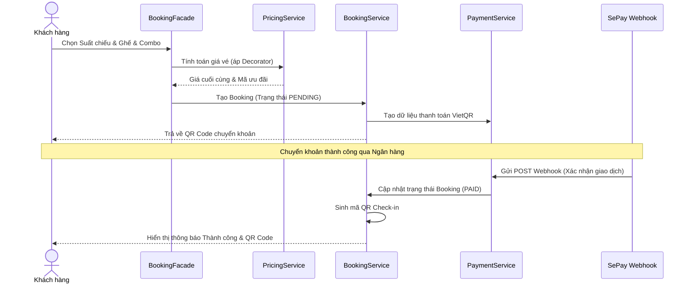
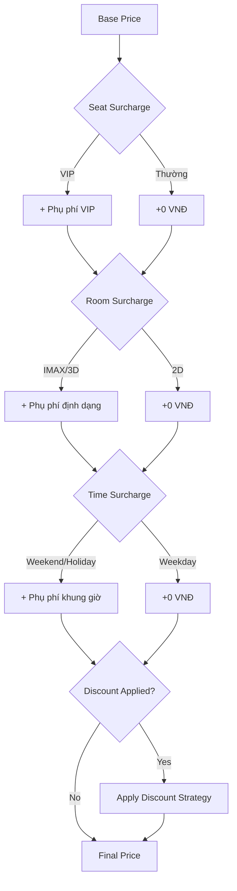

# 🔄 Luồng dữ liệu chính – Cinema Management System

Tài liệu này sử dụng sơ đồ Sequence và Step để mô phỏng các tương tác quan trọng giữa Actors và Hệ thống.

## 1. Luồng Đặt vé Online (Customer)

Mô phỏng quy trình đặt vé tích hợp thanh toán tự động qua `CustomerBookingFacade`.

---

## 2. Luồng Tính giá vé và Ưu đãi (Business Layer)

Mô phỏng cách hệ thống xử lý giá linh hoạt với `Strategy` và `Decorator`.

---

## 3. Luồng Quản trị (Admin/Manager Flow)

Mô tả cách hệ thống lắng nghe các thay đổi cấu hình quan trọng.

1.  **Thay đổi Lịch chiếu**:
    - Manager tạo `Showtime` mới.
    - `SchedulingStrategy` kiểm tra xung đột phòng và thời gian dọn dẹp giữa các suất chiếu.
    - Cập nhật Redis Caching để cập diện lịch chiếu mới cho Khách hàng tức thì.

2.  **Quản lý Phim**:
    - Admin tìm kiếm phim qua **TMDB integration**.
    - Hệ thống map dữ liệu TMDB (Poster, Trailer, Nội dung) sang Entity của hệ thống.
    - `CloudinaryFacade` tải ảnh Poster lên Cloudinary và lưu URL vào DB.

---

## 4. Đặc điểm Luồng Thanh toán Webhook (SePay)

Cơ chế xử lý **Stateless Callback**:
- SePay POST dữ liệu đến `/api/webhook/sepay`.
- Hệ thống giải mã và kiểm tra ID Booking trong nội dung giao dịch.
- So khớp giá trị chuyển khoản với tổng tiền Booking.
- Nếu khớp: Chuyển trạng thái Booking sang `PAID`.
- Nếu lệch: Ghi log cảnh báo và giữ nguyên trạng thái `PENDING`.
