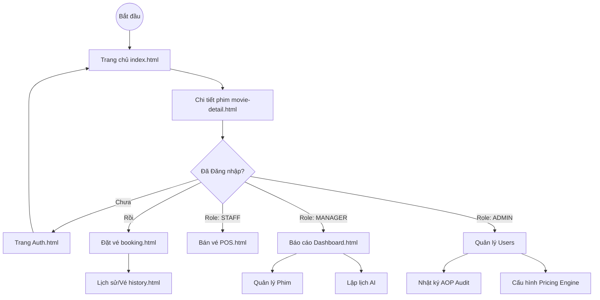

# 4.2. DANH SÁCH MÀN HÌNH VÀ SƠ ĐỒ CHUYỂN ĐỔI

Phần này liệt kê chi tiết danh sách các màn hình của hệ thống **FlashCinema** và các luồng điều hướng (Navigation Flow) dành cho từng vai trò người dùng cụ thể.

---

### 4.2.1. Danh sách các màn hình hệ thống

Dựa trên cấu trúc ứng dụng thực tế, hệ thống bao gồm các nhóm màn hình chính sau:

| Nhóm màn hình | Tên file vật lý | Vai trò truy cập | Mô tả chức năng |
|:--- |:--- |:--- |:--- |
| **Công cộng (Public)** | `index.html` | Mọi đối tượng | Trang chủ, danh sách phim đang chiếu. |
| | `movie-detail.html` | Mọi đối tượng | Chi tiết phim, trailer và lịch chiếu từ TMDB. |
| | `auth.html` | Chưa đăng nhập | Đăng nhập, Đăng ký và Quên mật khẩu. |
| **Khách hàng (Customer)**| `booking.html` | Customer | Quy trình chọn ghế và thanh toán VietQR. |
| | `profile.html` | Customer | Thông tin cá nhân, hạng thành viên Progress. |
| | `history.html` | Customer | Lịch sử đặt vé và mã QR vé điện tử. |
| **Nhân viên (Staff)** | `pos.html` | Staff, Manager | Bán vé trực tiếp tại quầy linh hoạt. |
| | `manage-bookings.html`| Staff, Manager | Tra cứu và check-in vé khách hàng. |
| **Quản lý (Manager)** | `dashboard.html` | Admin, Manager | Bảng điều khiển thống kê doanh thu đa chiều. |
| | `manage-movies.html` | Manager | Quản lý kho phim và đồng bộ TMDB. |
| | `manage-showtimes.html`| Manager | Lập lịch chiếu tự động bằng Gemini AI. |
| | `manage-rooms.html` | Manager | Quản lý phòng máy và sơ đồ ghế. |
| **Hệ thống (Admin)** | `manage-users.html` | Admin | Quản lý tài khoản và phân quyền RBAC. |
| | `manage-pricing.html` | Admin, Manager | Cấu hình PriceDecorator Engine. |
| | `manage-membership.html`| Admin | Quản lý hạng thành viên và quyền lợi. |
| | `manage-audit.html` | Admin | Theo dõi nhật ký hoạt động qua AOP. |

---

### 4.2.2. Sơ đồ chuyển đổi màn hình (State Transition Diagram)

Hệ thống phân luồng chuyển đổi dựa trên trạng thái xác thực và vai trò của người dùng:

---

### 4.2.3. Mô tả chi tiết các màn hình trọng tâm

#### 1. Màn hình Đặt vé (Booking Screen)
- **Cấu trúc:** Tích hợp Sơ đồ phòng chiếu thời gian thực và Summary Card thông minh.
- **Logic:** Tự động khóa ghế tạm thời trên **Redis** và tính giá động thông qua `PriceDecorator` ngay khi người dùng chọn ghế.

#### 2. Màn hình Lập lịch AI (AI Scheduling Screen)
- **Cấu trúc:** Giao diện quản lý suất chiếu dạng Timeline hỗ trợ trực quan hóa.
- **Tính năng:** Tích hợp nút **"Gợi ý lịch AI"** sử dụng Gemini API để tự động đề xuất phương án lấp đầy suất chiếu tối ưu doanh thu.

#### 3. Trang cá nhân và Membership (User Profile)
- **Cấu trúc:** Hiển thị thẻ VIP điện tử và thanh tiến trình chi tiêu (Progress Bar) để nâng hạng thành viên.

#### 4. Màn hình POS (Point of Sale)
- **Cấu trúc:** Giao diện tối giản dành cho nhân viên quầy, tối ưu hóa tốc độ xử lý giao dịch trực tiếp.

---
*Ghi chú: Toàn bộ các trang quản trị được tích hợp Side-menu thống nhất để đảm bảo trải nghiệm quản trị đồng bộ.*
