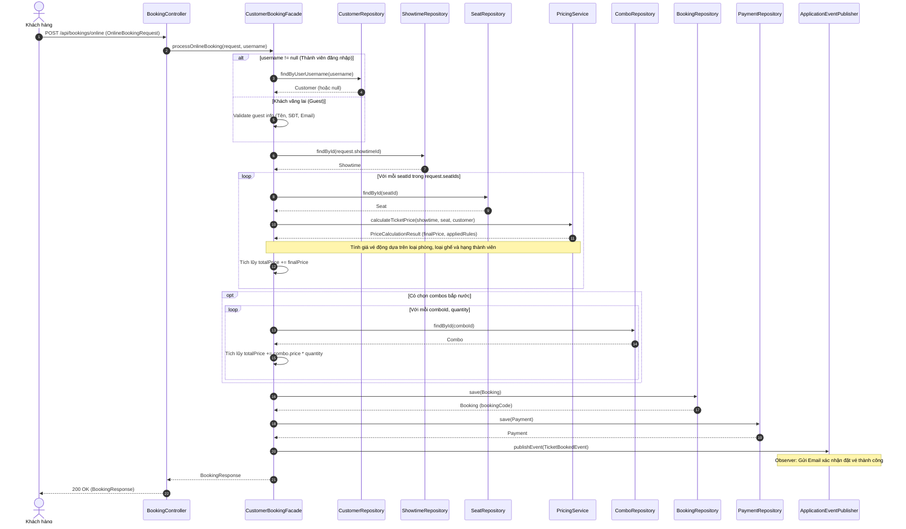
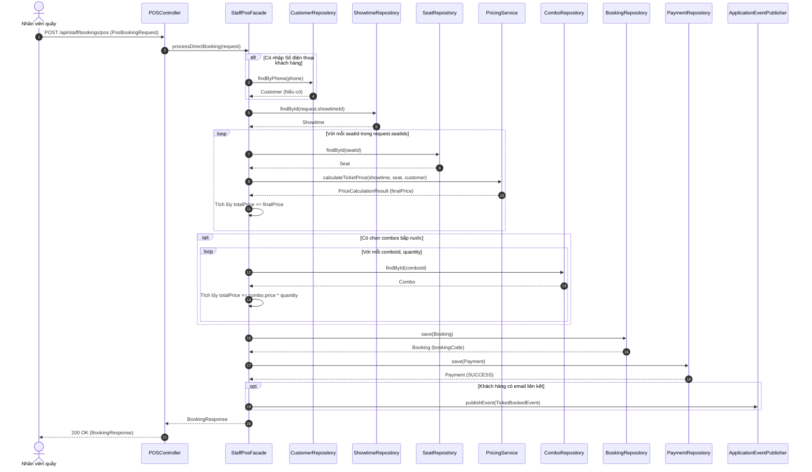

# 🎭 Sequence Diagram - Luồng Đặt Vé Tích Hợp Pricing Engine

Đây là bản thiết kế cho **Step 1.1** thuộc [CONDUCTOR.md](file:///d:/Fullit/projects/NNLTTT/Final/CINEMA_MANAGEMENT_SYSTEM/CONDUCTOR.md). Sơ đồ mô tả luồng đặt vé online/quầy đã được refactor để tuân thủ SOLID:
1. Xác định khách hàng thông qua Query Method (không dùng `findAll().stream()`).
2. Gọi `PricingService` để tính giá vé động cho từng ghế (áp dụng VIP surcharge, weekend rule, member discount) thay vì nhân cứng 95.000đ.

---

## 1. Sequence Diagram: Luồng Đặt Vé Online (CustomerBookingFacade)

---

## 2. Sequence Diagram: Luồng Bán Vé Tại Quầy (StaffPosFacade)

